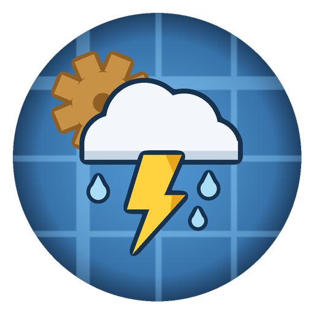

# Weather Inducer: a Create addon



A [Create](https://github.com/Creators-of-Create/Create) addon for **Minecraft 1.21.1 / NeoForge 21.1.233 / Create 6.0.10** for controlling the weather with kinetic power:

| Block | What it does |
| ----- | ------------ |
| **Weather Inducer** | Charges from the network's **spare SU** (provided capacity minus used stress) up to **1,048,576 SU** (2^20), at up to **131,072 SU per tick** (2^17). When fully charged and pulsed with redstone, it applies the selected weather effect: **rain**, **clear**, or **lightning** at a configurable position, provided it can see the sky. |
| **SU Resistor** | A **circuit breaker** for kinetic stress: if the machines downstream of it draw more SU than its limit, it trips and cuts rotation to that side, and latches until the limit is raised to cover the recorded demand. |
| **Stress Gate** | An inline shaft block that stays **locked** until the kinetic network provides at least a set amount of total SU. Use it to keep contraptions dormant until the power plant is big enough. |
| **SU Charger** | A kinetic capacitor. Rotation passes through it, **SU never does**. While the shaft turns it fills a **1,048,576 SU** buffer from its input side; once the input stops, machines on its output side drain the buffer. Emits a redstone signal proportional to its fill level. |
| **Weather Sensor** | A daylight-detector-shaped slab that reads the sky: redstone **0** when clear, **7** in rain, **15** in a thunderstorm. Covered, it reads 0. |
| **Lightning Medium** | A beacon and an end crystal encased in glass. Struck by lightning, it shatters into a **Bottle o' Lightning**, the base of the lightning gear. |

---

## Gameplay

### Weather Inducer
- **Kinetic input:** a shaft on the front/back faces (the facing axis).
- **Charging:** each tick the inducer soaks up the network's spare SU, `min(capacity - stress, 131,072)`, until it holds 1,048,576 SU. A network with plenty of free capacity fills it in eight ticks; a network busy running machines charges it with whatever is left over. A discharging SU Charger tops it up when the network itself has nothing to spare.
- **Sky line-of-sight:** the block directly above must be able to see the sky, or firing is blocked.
- **Mode (top value box):** Create's option menu with an icon and label per entry; scroll or drag to pick `Rain` / `Clear` / `Lightning`.
- **Lightning offset (side value boxes):** two scrolls set the X/Z offset (-64 to +64) of the lightning strike, measured from the inducer. The strike lands on the surface at that column.
- **Trigger:** a **rising redstone edge** fires the selected effect when fully charged, then discharges the block back to 0 SU (it must recharge before firing again).
- **Charge indicator:** the bolt emblem on the sides lights up gold from the tip upward in sixths of a full charge, so the fill level is readable at a glance. Goggles show the exact SU numbers.
- **Comparator:** emits a redstone signal (0 to 15) proportional to charge.

### SU Resistor
- **Inline shaft:** rotation passes straight through along its axis, exactly like a shaft, until the breaker trips.
- **Limit (value box on the four side faces):** scrolls through a power-of-two ladder (0, then 64 up to 1,048,576; default 1,024) instead of counting single SU.
- **Breaker:** every half second the resistor sums the stress demand of the machines downstream of it (impact times RPM, so two encased fans at 256 RPM read 1,024 SU). Demand above the limit trips it: rotation to the downstream side cuts out clutch-style and the ceramic body glows overload-hot.
- **Latching reset, no oscillation:** the trip records the demand that broke it, and a tripped resistor does no re-scanning at all. It closes again automatically the moment its limit is raised to cover that recorded demand; since closing requires the limit to cover the load, the same load can never re-trip it. Goggles show the live draw while closed and the break demand while tripped.

### SU Charger
- **Inline shaft with a direction:** rotation passes through along the facing axis, but SU never crosses the block. Placed dropper-style, the output face points away from you.
- **Charge mode (shaft turning):** the charger soaks the network's spare SU into a 1,048,576 SU buffer, at up to 131,072 SU per tick.
- **Discharge mode (shaft stopped):** stop the input (a clutch works nicely) and consumers on the **output** face may drain the buffer at up to 131,072 SU per tick. An inducer fed only by a charger fires exactly once per buffer fill.
- **Redstone output:** the block itself emits a signal of 0 to 15 proportional to the buffer fill, so wires (or the clutch feeding it) can react to the charge level directly. A comparator reads the same value, and goggles show the exact numbers and the current mode.
- **Fill indicator:** the gap between the capacitor plates on the side faces fills with teal as the buffer charges.

### Stress Gate
- **Inline shaft with a lock:** below its threshold the gate passes no rotation downstream, like a disengaged clutch; the padlock on its body shows a red pip.
- **Threshold (value box on the four side faces):** the same power-of-two ladder as the resistor (default 131,072 SU). Once the network's **total provided SU** reaches it, the gate unlocks and rotation flows.
- The provided capacity comes purely from the source side, so locking the downstream away never changes the reading: the gate cannot oscillate. Goggles show the threshold, the current provision, and the lock state.

### Weather Sensor
- **Daylight detector, but for weather:** a 6px slab that must see the sky.
- **Output:** redstone 0 under clear skies, 7 in rain, 15 during a thunderstorm; 0 when covered. It re-reads the weather every half second.
- Feed it into the Weather Inducer's trigger line to build self-acting weather machines, for example one that clears every storm as it rolls in.

### Lightning gear
The endgame chain, powered by the Weather Inducer's own lightning:

1. **Lightning Medium**: craft a beacon and an end crystal into a glass shell
   (recipe below). Place it under open sky and strike it with lightning; the
   block is consumed and drops a **Bottle o' Lightning**. An inducer in
   lightning mode with a matching offset automates the whole thing, and the
   bottle survives the strike that creates it.
2. **Lightning Bolt**: one ancient debris plus two bottles, laid out as a
   diagonal in the crafting grid.
3. **Tools** (sword, pickaxe, axe, shovel, hoe): the usual shapes, with
   stripped logs instead of sticks. 4,096 durability, mining speed 16, and
   the diggers come out of the crafting table with Efficiency V already on
   them. The sword hits for 1,024 damage, which one-shots everything up to
   and including the warden. Holding any lightning tool grants Speed II.
4. **Armor**: Thor-styled steel with gold discs and a winged helm. The
   chestplate recipe also takes an elytra. Each piece comes with Thorns III;
   the full set grants water breathing, fire resistance, Resistance IV,
   Strength II, Speed II, Regeneration, creative flight, and no fall damage.
   With 40 armor points, toughness 16, and full knockback resistance on top,
   it is practically invincible.

---

## Crafting recipes

**Weather Inducer** (Precision-Mechanism tier):
```
L C L      L = Lightning Rod        C = Copper Block
E P E      E = Electron Tube        P = Precision Mechanism
B S B      B = Brass Sheet          S = Shaft
```

**SU Resistor** (yields 2):
```
N B N      N = Andesite Alloy       B = Brass Sheet
S G S      S = Shaft                G = Cogwheel
N B N
```

**SU Charger**:
```
B C B      B = Brass Sheet          C = Copper Block
S E S      S = Shaft                E = Electron Tube
B C B
```

**Stress Gate**:
```
N B N      N = Andesite Alloy       B = Brass Sheet
S E S      S = Shaft                E = Electron Tube
N B N
```

**Weather Sensor** (daylight detector layout):
```
G G G      G = Glass
C E C      C = Copper Sheet         E = Electron Tube
A A A      A = Andesite Alloy
```

**Lightning Medium**:
```
G G G      G = Glass
G C G      C = End Crystal
G B G      B = Beacon
```

**Lightning Bolt** (a diagonal, like its namesake):
```
. . B      B = Bottle o' Lightning
. B .      A = Ancient Debris
A . .
```

**Lightning tools and armor**: vanilla shapes with Lightning Bolts as the
material; tools take stripped logs (any kind) instead of sticks, and the
chestplate takes an elytra in its centre slot.

---

## Mod integrations

All integrations are optional; the mod runs with none of them installed, and each
integration class only loads when its mod is present.

### Ponder
The Weather Inducer and SU Resistor ship in-game Ponder scenes (the newer
Weather Sensor, SU Charger, and Stress Gate do not have scenes yet; their
JEI/EMI info pages cover the mechanics). See them via the item tooltip's Ponder key or in
JEI/EMI. They demonstrate a creative motor driving a shaft through an SU
Resistor into a Weather Inducer, and explain SU charging, the sky
requirement, redstone firing, and the resistor throttle. The scene text is
authored inline in `ModPonderScenes`; datagen runs Ponder's registration and
writes the generated lang entries into `en_us.json` (`ModLanguageProvider`),
which is what makes the text actually show up in game.

### JEI & EMI
Both recipe viewers show the crafting recipes automatically, plus an **information
page** for each block describing its mechanics.

### ComputerCraft: Tweaked
A Weather Inducer exposes a `weather_inducer` peripheral:
```lua
local w = peripheral.find("weather_inducer")
print(w.getCharge() .. " / " .. w.getMaxCharge() .. " SU")
w.setMode("lightning")          -- "rain", "clear" or "lightning"
w.setLightningOffset(10, -4)    -- X/Z offset from the inducer
if w.isCharged() and w.canSeeSky() then w.fire() end
```

### KubeJS
A `WeatherInducer` binding is available to scripts:
```js
// server script
BlockEvents.rightClicked("minecraft:stick", event => {
  const pos = event.block.pos
  if (WeatherInducer.isCharged(event.level, pos)) {
    WeatherInducer.setMode(event.level, pos, "lightning")
    WeatherInducer.fire(event.level, pos)
  }
})
```

---

## Testing

Runtime game tests cover the Weather Inducer's fire logic. Run them headlessly:
```bash
./gradlew runGameTestServer
```
They verify: full-charge + sky + redstone fires and discharges; lightning mode
spawns a bolt; a blocked sky prevents firing; firing below full charge is a
no-op; a lightning strike consumes a Lightning Medium and bottles the strike
(the drop surviving the bolt); the Weather Sensor's signal follows thunder and clear skies (in its own
test batch, since weather is global); the SU Charger offers its buffer only
while its input is stopped, publishes the fill level as redstone, and drains
exactly what is taken; the SU Resistor trips on a real motor-and-fan overload
and cuts the fan off; and the Stress Gate stays locked below its threshold
and opens once the network provides enough.

---

## Building

```bash
./gradlew build
```
The built jar lands in `build/libs/` (`weatherinducer-<version>-mc1.21.1.jar`).
To launch a dev client/server:
```bash
./gradlew runClient
./gradlew runServer
```

This project **compiles cleanly against Create `6.0.10-281`** (the last 6.0.10
build) and its runtime stack. The exact coordinates are pinned in
`gradle.properties`; the repositories that serve them are declared in
`build.gradle`:
- Create, Flywheel, Ponder, Catnip: `https://maven.createmod.net`
- Registrate (`MC1.21-1.3.0+67`): `https://maven.ithundxr.dev/snapshots`

---

## Implementation notes

The **Create API touchpoints are deliberately isolated** so the integration is
easy to follow and maintain:

1. **`network/SUNetwork.java`** is the only class that reads Create's kinetic
   internals: `KineticBlockEntity#getOrCreateNetwork()`,
   `KineticNetwork#calculateCapacity()` (total provided SU), and the public
   `KineticNetwork.members` / `KineticNetwork.sources` maps used for the
   inline-resistor traversal.

2. **Value boxes**: the inducer's mode selector is a
   `ScrollOptionBehaviour<WeatherMode>` (the enum implements
   `INamedIconOptions`, so Create renders its option menu with icons); the
   offsets and the resistor cap are `ScrollValueBehaviour`s, the latter
   scrolling over an index into the logarithmic `STEPS` table rather than
   raw SU. All are positioned via `CenteredSideValueBoxTransform`
   (`content/util/SideValueBoxTransform.java`).

3. **Rendering**: `client/WeatherInducerClient.java` registers Create's
   generic `ShaftRenderer<>`. The block models leave a 2px deep socket
   around every shaft connection, so the spinning shaft the renderer draws
   is actually visible, like on other Create machines.

4. **Models and textures**: the mod ships its own 16x16 pixel art under
   `assets/weatherinducer/textures/block/`, styled after Create's brass and
   andesite casings (frame bars with corner brackets, plank interiors, a
   top-left light source and light dithering). The kinetic blocks use
   element models built in datagen, with matching voxel shapes and
   noOcclusion. The Weather Inducer is a stepped machine: a 13px casing
   base with socketed shaft bearings, topped by a raised copper emitter cap
   with a teal aperture, and the bolt emblem embossed half a pixel proud of
   both side faces (the raised geometry samples the same texture pixels as
   the flat art, so the two always line up). The inducer and the charger
   bake their fill level into the blockstate: six models each, pointing at
   side-texture variants where the bolt lights up gold (inducer) or the
   capacitor gap fills with teal (charger). A little copper lightning rod stands centered
   on the cap, plugged into the emitter aperture: a 2x2 pole with the
   vanilla rod's thicker tip. The SU Resistor is shaped like its namesake: two
   andesite collar flanges at the shaft ends with the banded ceramic body
   suspended between them; the bands read brown-black-red with a gold
   tolerance band, which is 1000 in the resistor color code and also its
   default SU draw cap.

### The SU model, in short
There is no custom SU bookkeeping layer. Consumers (Weather Inducer, SU
Charger) simply soak up their network's spare capacity each tick:
`min(calculateCapacity() - calculateStress(), 131,072)`. A stopped or fully
loaded network offers nothing. The SU Charger is the one battery-like
exception: it stores that spare SU in a buffer and, while its shaft stands
still, hands it to consumers found through a short physical walk from its
output face (`SUNetwork.drawFromChargers`); raw network SU never crosses it.

The SU Resistor polices real stress as a breaker: its block entity is a
`SplitShaftBlockEntity` (the same mechanism as Create's clutch), and while
closed it periodically sums downstream demand via a bounded physical walk
(`SUNetwork.downstreamStressDemand`, impact times the resistor's own speed).
Demand over the limit flips the TRIPPED blockstate and re-propagates rotation
gearshift-style. The trip records the offending demand; a tripped breaker
does no scanning and simply closes once the limit covers that recorded
number, which makes oscillation structurally impossible. The Stress Gate
uses the same clutch mechanism in reverse: it stays locked until
`calculateCapacity()` reaches its threshold, a reading that only depends on
the source side, so it cannot flap either. Both are covered by game tests
that spin a real creative motor and encased fan.

## License
MIT
